# Installing Git

On University machines, Git is available through [AppsAnywhere](https://appsanywhere.yorksj.ac.uk/app/bcf31522-552e-11ed-b5a1-005056ae5b42). After it is installed, it should be available through the command line as the `git` command (you may need to restart your terminal to load the updated PATH). You will also find Git GUI and Git Bash from your Start menu. For most of these instructions you will be using Git GUI or Git Bash.

On your personal machine, you can find instructions for installing Git on the git website (<https://git-scm.com/>). If you use Linux, Git is probably in your distribution's repository. If you prefer, you can also install the Github Desktop App.
(<https://desktop.github.com/download/>)

# Authenticating with GitHub

Performing certain actions on a git server requires authentication. For example, reading a private repository, or pushing to a repository. There are two ways to authenticate with git: HTTPS and SSH. Your choice of authentication method will dictate the URL of the repository you are accessing.

    https://github.com/username/repo.git

    git@github.com:username/repo.git

Typically, if you connect to a git server over HTTPS, it will request your username and password in the terminal. However, GitHub doesn't allow authentication with username and password. If you choose this method you will need to use OAuth or a Personal Access Token.

SSH authentication is convenient when you do not want to be asked to re-enter your username and password frequently. An SSH key is stored on your machine and accessed when required. If you want to use this method, you will need to create an SSH key on your machine and register it on GitHub.

## OAuth Authentication using GitHub Desktop

GitHub Desktop and many other Git clients (including VS Code) use OAuth to authenticate you to hosts (such as GitHub) that support it. If you are using one of these apps, a box should pop up when authentication is required asking for you to log in.

## Personal Access Token

If you are using the command line, the simplest (but not necessarily the best) alternative is to use a Personal Access Token. A personal access token allows us to authenticate with GitHub over the command line. This is basically a password, so keep it safe.

You create a personal access token through GitHub. Go to `GitHub Settings /	Developer Settings`.

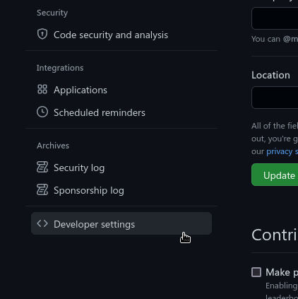

Under `Personal access tokens`, find `Tokens (classic)`. Click `Generate new token` (top right).

**Note:** Once you are more familiar with GitHub, it would be a good idea to use a fine-grained token instead. These let you control specific permissions of the token.

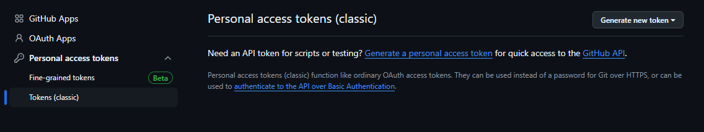

Give the token control over repositories.

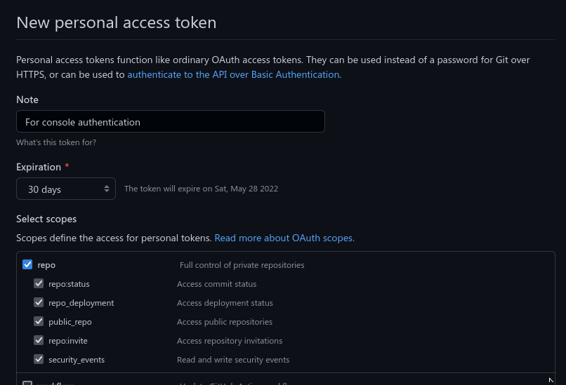

Copy the code it gives you. This is what to use instead of your password in the console when authenticating with a GitHub git server.

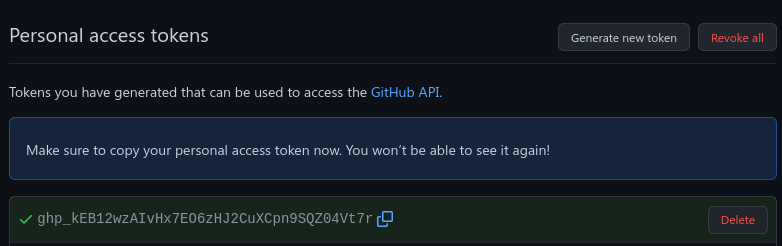

Now you connect to a git repository hosted on GitHub with an HTTPS url (e.g. `https://github.com/username/repo.git`). You will need to type in your username and enter this token as your password.

## SSH authentication with SSH Key

Personal Access Tokens are awkward to use as they require copying a password. They can be less secure as you need to keep a copy of the password accessible, where it could be accidently pasted into the wrong window, for example.

A better long-term solution is to create an SSH key. Once you have created and configured an SSH key, you will automatically authenticate with the git server when connecting over SSH. The easiest method is to create an SSH key through Git GUI. Alternatively, you may need to use the command line.

### Using Git GUI

In Git GUI go to `Help > Show SSH Key`

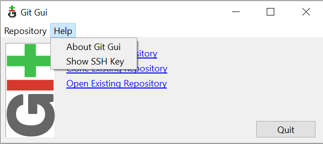

If you have not configured a key already, you must click `Generate Key`.

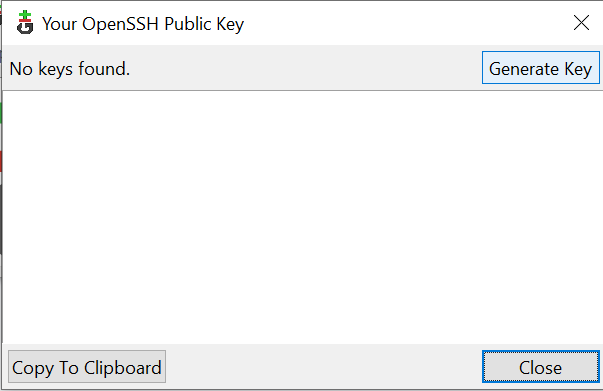

Enter a passphrase for the key if you wish. A passphrase protects the key from use if someone else gains access to the key file. If the key is on a secure computer, a passphrase may not be required.

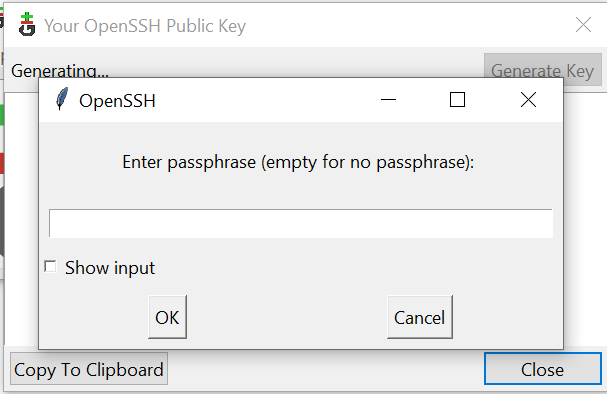

Once the key has been generated, it will be visible in Git GUI under `Help > Show SSH Key`. The text displayed is the text you will need to copy into GitHub to configure the key.

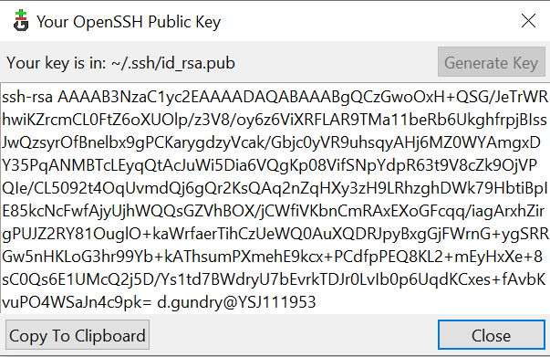

The key file is stored on the local machine in `~/.ssh/`. This is where Git looks for SSH keys. On Windows this corresponds to `C:\Windows\Users\<username>\.ssh\`. The `.pub` file is your public key - what you need to copy in to GitHub. The other file is your private key. This must be kept secure. 

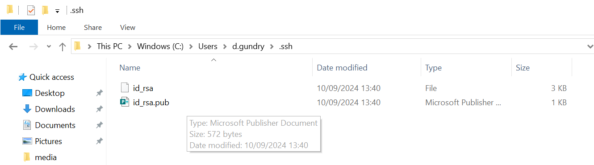

The contents of the `C:\Windows\Users\<username>\.ssh\` directory will not be shared between machines on the University network. As it would be time consuming to generate and configure a new key for each machine you use, you mays wish to take a copy of your key files and store them on e.g. OneDrive so you can copy them to whichever machine you find yourself using. To add an SSH key to a new machine, simply copy the key files into the `.ssh` directory.

Once you have done this you can skip ahead to the 'Adding the SSH Key to GitHub' section.

### Using the command line

If you prefer, you can use the command line to generate an SSH key. On Windows, installing Git should have installed Git Bash. Use this as your terminal for these commands.

Generate your ssh key using `ssh-keygen`. There are various [configuration options](https://man7.org/linux/man-pages/man1/ssh-keygen.1.html) available if you want to specify the type of encryption used. The `ed25519` key type is recommended in the [GitHub documentation](https://docs.github.com/en/authentication/connecting-to-github-with-ssh/generating-a-new-ssh-key-and-adding-it-to-the-ssh-agent).

    ssh-keygen -t ed25519 -C "<your email>"

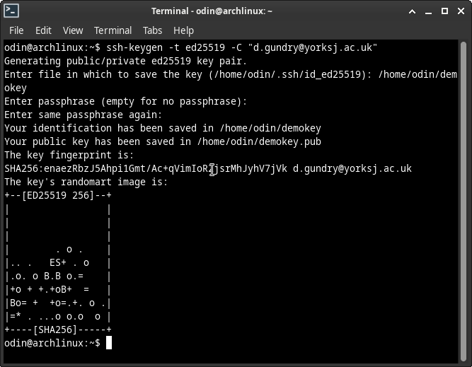

Copy the content of the `.pub` file created. This is your public key. The other file is the private key.

Before you can authenticate with your key, it needs to be added to `ssh-agent`

Start ssh-agent. If you are using Git for Windows this is probably already running.

    eval \"\$(ssh-agent -s)\"

Add your private key. An appropriate place to store your keys is in `~/.ssh`. However, if you are on a University machine, be aware that `C:\Windows\Users\<username>\.ssh\` will not be shared between computers.

    ssh-add /path/to/key/file

Depending on your configuration, this may only remember your key for the session.

Now you have done this, move on to the 'Adding the SSH Key to GitHub' section.

### Adding the SSH Key to GitHub

Go to `GitHub Settings \	SSH and GPG keys \	New SSH Key`

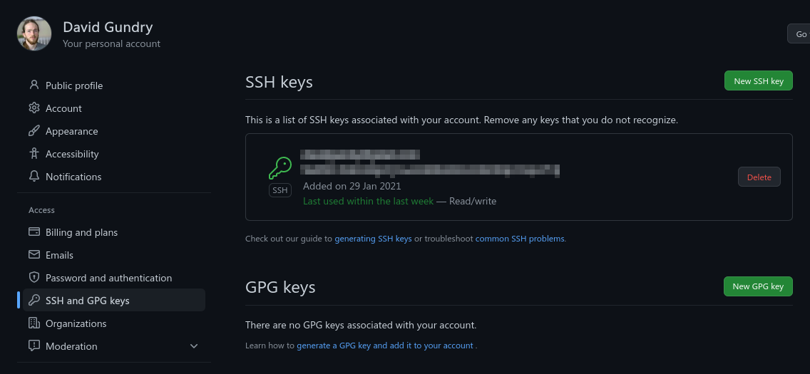

Paste your public key into the Key field and click `Add SSH key`. If you generated an SSH key via command line your public key is the content of the `.pub` file.

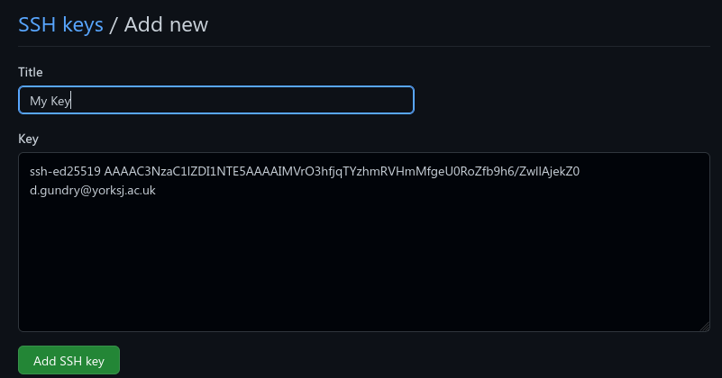

One the public key of an SSH public-private key pair is registered on GitHub, you can use git over SSH (i.e where the URL to the remote is of the form `git@github.com/username/repo.git`).

## Further Reading

* https://www.atlassian.com/git/tutorials/git-ssh
* https://docs.github.com/en/authentication/keeping-your-account-and-data-secure/managing-your-personal-access-tokens