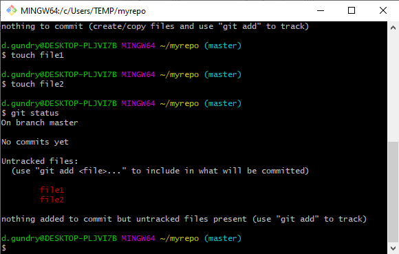
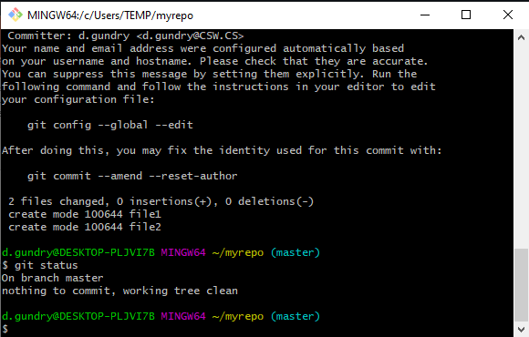

# Creating a repository

You should already have installed Git. You should be able to open Git Bash (Windows) and/or run the `git` command from a terminal. If you cannot, go back to [part 1, Configuring Git](./1-configuring-git.md)

Next we're going to see

1.  How to create a new repository from scratch
2.  How to make our first commit

## Creating a Repository through the Command Line

Open your terminal emulator of choice. On Windows you should use Git Bash. Navigate to wherever you want to store your project. (**Hint:** use `ls` and `cd` commands to orient yourself and change directory.)

Make a directory to store your repository:

    mkdir myrepo

Enter that directory:

    cd myrepo

Initialise a git repository in this directory. All of the contents of the `myrepo` directory will be tracked by this git repository. That is, you run the following command _inside_ your project folder to track:

    git init

Now, to make sure everything has worked, check the status of the repository. You should see something like the screenshot below.

    git status

## Creating our initial commit

Next we need to add some files for our repository to store. If you have initialised this repository in the directory of an existing project, you will see these files listed in `git status` as untracked files. If you have created a new directory, you can copy in your project files. In the screenshots I've used the `touch` command to create empty files for the demo.

Once we have some files in our directory, let's check the status of the repository.

    git status

There will be unstaged changes (shown in red). It explains that we have untracked files (files Git has no information about).

We need to decide what files we want to include in our commit. Typically we want to include all changed files. If you prefer, you can identify specific files or folders to stage. To stage all changes in the current directory use:

    git add .

Check the status of the repository again.

    git status

It will now show that there are staged changes (shown in green). Staged changes are those changes that are going to be included in the commit we are about to make.

Commit the staged changes with a message:

    git commit -m "<message>"

Typically we want to use a descriptive commit message saying what has changed since the last commit. However, if you are creating an empty repository, t's common to use "Initial commit" for the first commit message.

Let us check the status of the repository again:

    git status

This should show that there are no changes to the repository as all our changes have been committed.

We have now created a repository and successfully committed some files to it.

## Making further commits

Git is _version control_ software because it allows us to track changes to files over time: we can recover different _versions_ of the files. There is not much benefit in making a Git repository just to store files. The real power of git comes when we make and commit changes to our project over time.

After you have completed some work on your project, you will want to commit your changes. 

First, check the status of your repository. (You can skip this if you like, but I find it helpful to double-check I am committing the changes I think I am.)

    git status

Next, stage the changes to commit:

    git add .

Next, check the repository status again. You might think this is excessive, but I have often caught errors this way where I have accidently staged files I didn't mean to. Alternatively, sometimes files are missed because your working directory (where you ran `git add .` is not the root of the project).

    git status

Assuming we are happy with the changes to commit, we run:

    git commit -m "My descriptive message here"

You can check the status with `git status` and see a log of recent commits with `git log` to confirm that the changes have been committed.

## Conclusion

At this point, you can already gain a substantial benefit of using Git for version control for your own personal files. Almost all of my projects are tracked using git, even if I only store them on my personal machine. In [part 3](./3-set-remote-and-push.md), we will see how to sync this repository with GitHub.

Remember that Git is not magic. It will only store the changes to files when you decide to commit them. Good practices when using Git are essential to make the most of it.
