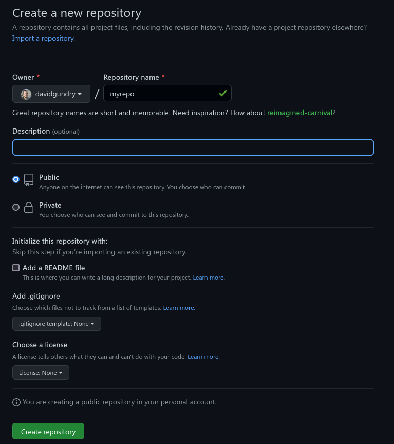

# Set a remote and push commits 

You should have Git installed and a way of authenticating with GitHub. If not, go back to [part 1](./1-configuring-git.md). You should also have created a local repository. If not, go back to [part 2](./2-creating-a-repo.md).

Next we're going to see

1.  How to associate our local repository with an empty remote repository
2.  How to push our commits to the remote

## Create a remote repository

Go to GitHub and create an empty repository. Click the `+` button and select `New repository`.

Set some details for the repository. For now you probably want the repository to be private. Do not add readme, `.gitignore` or license as these will mean the repository is not empty.

It will tell is the URL of the repository. Note the URL of your repository ends in `.git`. It is different from the address in your webbrowser for the GitHub page for your repository.

You will need to copy one of these URLs. There are two options:

-   HTTPS (connect via HTTPS)
-   SSH (connect via SSH)

The main difference is how you will authenticate with GitHub (see [part 1](./1-configuring-git.md)):

-   HTTPS: personal access token
-   SSH: ssh key

## Set the remote of your local repository

Open your terminal emulator of choice and navigate into your repository directory. On Windows use Git Bash. (**Hint:** use `ls` and `cd` commands to orient yourself and change directory.)

Add the GitHub repository as a remote called `origin`. We need to supply the url of the repository that we selected above.

    git remote add origin <url>

GitHub calls its main branch `main` instead of `master` Rename our current branch (master) to follow this standard:

    git branch -M main

Push the commits that are stored in your local repository. The first time we do this, we need to tell our main branch where it needs to push to

    git push -u origin main

Our upstream for the `main` branch is now set to the `main` branch on our remote called `origin`.

Once this has been done, in the future we can push changes with:

    git push

If the push completes without errors, the upstream for the branch will now contain the latest commits. You can check this by going to GitHub and viewing your repository at

    https://github.com/<username>/<repository>/

You should see your committed changes through GitHub's web interface.

## Conclusion

You can now create a repository and store it on GitHub. Note that in this tutorial so far we have initialised the repository on our local machine. We created an empty repository on GitHub. An alternative is to create a repository on GitHub that contains files (e.g. a readme) and then clone this. You will see how to clone an existing repository in [Part 4, Clone a Repo](./4-clone-a-repo.md).