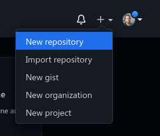
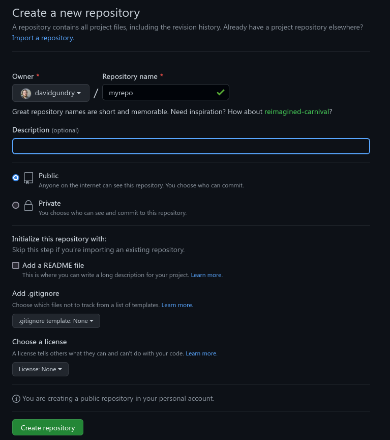
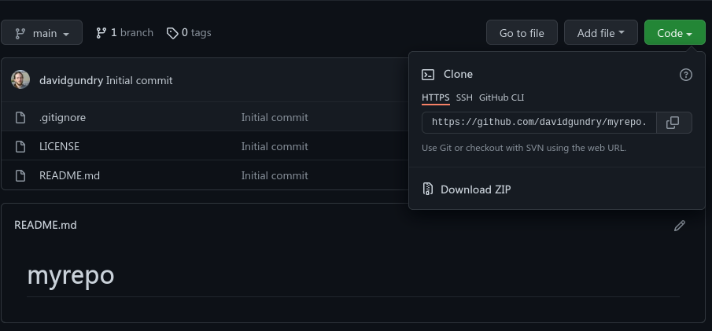
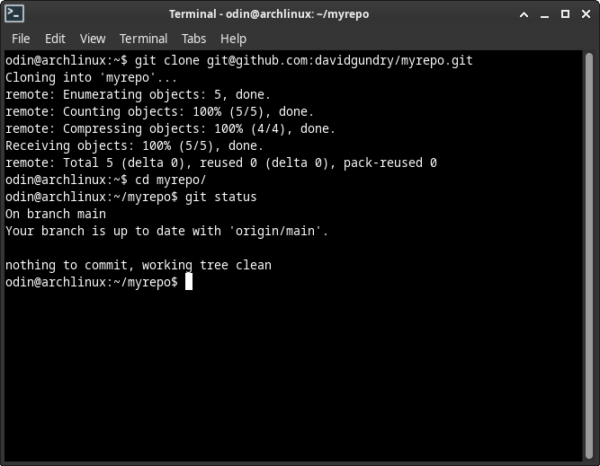

# Clone an Existing Repository

You should have Git installed. If not, go back to [part 1](./1-configuring-git.md). In [part 2](./2-creating-a-repo.md) and [part 3](./3-set-remote-and-push.md), we created a repository locally and pushed this to GitHub.

Next we are going to see how to make a local copy of a remote repository. This is called cloning the repository.

## Cloning a remote repository

When a repository already exists on our Git server (e.g. GitHub), we do not want to create a new repository, we want to clone that existing repository.

Start by finding or creating a repository on e.g. GitHub. If you created a repository as part of this tutorial, you can make another clone of this repository.

If you want to create a new repository on GitHub, click the `+` and select `New repository`.

Here we need there to be content in the repository, so if you are creating a new repository for this on GitHub feel free to
add Readme, `.gitignore`, and license.

Find the URL of the repository. On Git you can find this under the `code` drop down. You will need to choose HTTPS or SSH depending on how you authenticate with GitHub (see [Part 1, Configuring Git](./1-configuring-git.md)).

Once we have the URL of the repository from GitHub (see image) we can clone it. The following command will create a folder in your working directory containing the repository:

    git clone <repository-url>

(Note: if you want the directory to have a different name to the repository, use the command `git clone <repository-url> <directory-name>`)

Enter the directory

    cd <directory-name>

Check the status of the repository

    git status

If you have created a repository on git, you will see that the primary branch has the name `main` by default.

## Cloning a local repository

Wjhile the repository URL can be a URL to a remote repository, you can also clone a repository from another folder on the local hard disk:

    git clone /path/to/repository/.git

Note that the path leads to the `.git` (hidden) directory inside the repository folder.

Trying to push changes to a remote that itself has changes in its working directory can make things more complicated. Generally you would use a server such as GitHub for your repositories. If you want to host your own repository, consider using a [bare repository](https://www.theserverside.com/blog/Coffee-Talk-Java-News-Stories-and-Opinions/What-is-a-bare-git-repository).

## Conclusion

Now you can initialise a Git repository, add commits, push it to GitHub, and clone it elsewhere. These are all the basics you need to start working with Git.