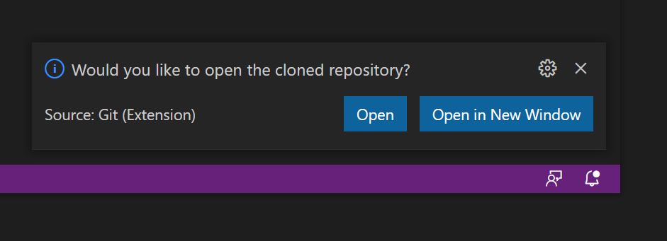

# Git in Visual Studio Code

Like most IDEs, Visual Studio Code integrates with Git to make it easy to perform everyday Git tasks. In Visual Studio Code, there should be an icon in the left-hand bar that looks like this. Click on it to open the Source Control sidebar.

## Cloning A Repository

Ensure you have closed any files/projects you have open and Click on the Git button in the sidebar.

Click on the **Clone Repository** button and enter the URL of the repo you want to clone in the window that pops up.

Create a new folder to clone the repository to and select it.

Click the **Open** button.

If you click on the Explorer icon at the top of the sidebar you should see the list of all the files in the repo you've just cloned. When you make changes to the project VSC & Git will detect those changes. You can then use VSC to commit and push those changes to, or pull changes from, a remote repo. 

You can perform many actions by clicking on the three dots in the Source Control sidebar.

## Taking a copy of an existing repository

If you have cloned a third-party repository, you may wish to disconnect your copy from the original repository (remote). You will want to add a remote for your own remote repository.

1.  Click the **Source Code** icon in the side bar
2.  Click on the **...** in the side bar (see  the image above)
3.  Select **Remote \>** then **Remove Remote**. Select the name from the list. (If there is more than one, remove them all one by one)
4.  Click on the **...** in the side bar.
5.  Select **Remote \>** then **Add Remote..**.
    1.  Paste the URL of your repository
    2.  Enter the name `origin`
6.  Click on the **...** in the side bar.
7.  Select **Push**
    1.  Click **OK** if a message box pops up.

## Adding a project you've created to your repository

If you have created a new project (rather than having cloned it from
somewhere), follow the instructions below.

1.  Click the **Source Code** icon in the side bar
2.  Click the **Initialize Repository** button
3.  Click on the **...** in the side bar.
4.  Select **Remote \>** then **Add Remote..**.
    1.  Paste the URL of your repository
    2.  Enter the name `origin`
5.  Click on the tick icon in the side bar.
6.  Enter a commit message
7.  Press the **Sync Changes** button.

## Uploading changes

After you have made changes to your code you need to commit and push
those changes.

1.  Click the **Source Code** icon in the side bar
2.  Click on the tick icon in the side bar.
3.  Enter a commit message
4.  Press the **Sync Changes** button.

#### Pulling Changes

1.  Click the **Source Code** icon in the side bar
2.  Click on the **...** in the side bar.
3.  Select **Pull**